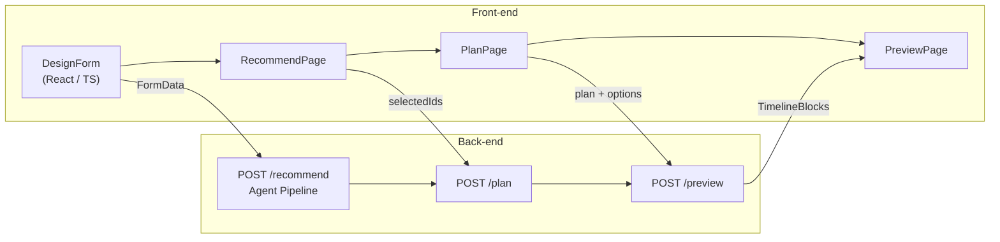

# CardTrip — AI-Agent Travel Planner Hackathon Submission (English Version)

---

## Project Overview  

CardTrip is an **“AI Agent × full-stack”** travel-planning platform that delivers a complete trip schedule in three simple steps:

1. **Form → AI Agent → POI Recommendation → Scheduling → 4-Quadrant Preview**  
2. A multi-tool *Travel Agent* (LLM + Google APIs + crawler) automatically performs:  
   *keyword extraction → query generation → POI aggregation → review scraping → card fusion → scoring & ranking → itinerary optimization*.  
3. The front-end provides two core pages—**Card Selector** and **Timeline Preview**—that stay in real-time sync with the Agent.

---

## AI Agent Goals & Hackathon Alignment  

| Hackathon Criteria | CardTrip v3 Implementation |
| :-- | :-- |
| **Tool Usage** | Google Places & Directions APIs, XHS crawler, OpenAI Chat Completions |
| **Autonomous Chain of Thought** | ① Keyword parse → ② multi-city queries → ③ POI clean → ④ review highlighting → ⑤ card fusion → ⑥ scoring → ⑦ style classification → ⑧ day splitting → ⑨ half-day timeline |
| **Interactive** | Front-end lets users re-rank cards; Agent re-learns tags from feedback |
| **End-to-End Demo** | Submit form → receive map + timeline + calendar preview |

---

## Requirements, Features & UX  

* **Goal**  Produce a realistic, visual day-by-day itinerary in **< 2 minutes**  
* **Key Features**  
  * Smart POI cards (rating, tags, image)  
  * One-click scheduling (day → AM/PM → minute blocks)  
  * 4-Quadrant Preview: Map · Axis · Calendar · Text in perfect sync  
* **UX**  Mobile-first card flow, desktop-grade timeline; minimal 3-step journey

---

## 1 System Overview  



---

## 2 Full API Layer & Integration  

| Method | Route | Request (key fields) | Response (key fields) | Used by |
| :-- | :-- | :-- | :-- | :-- |
| **POST** | `/recommend` | `FormData` | `cards[]`, `all_pois[]`, `min_required` | RecommendPage |
| **GET** | `/recommend/more` | `start,size` | `cards[]` | “More Cards” |
| **POST** | `/plan` | `accepted_pois[]`, `all_pois[]`, _FormData_ | `plan{ Day → POI[] }`, `options` | PlanPage |
| **POST** | `/preview` | `plan`, `options` | `full_schedule{ date → TimelineBlock[] }` | PreviewPage |

> **Type Safety** — Both ends reuse `@/types/FormData.ts`, `@/types/POI.ts`, `@/types/TimelineBlock.ts`.

---

## 3 Prototype UI & State Flow  

| Page | Key State | Action | Next Page |
| :-- | :-- | :-- | :-- |
| DesignPage | `FormData` | **Start Recommendation** | ➜ Recommend |
| RecommendPage | `selectedIds`, `cards[]` | **I’m Done** | ➜ Plan |
| PlanPage | `plan{}` | **Preview** | ➜ Preview |
| PreviewPage | `selectedDay`, `activeId` | calendar / hover / click | live 4-quadrant sync |

---

## 4 Tech Stack & Setup  

| Layer | Stack | Notes |
| :-- | :-- | :-- |
| Front-end | React 18, Vite, TypeScript, TailwindCSS | SPA, instant HMR |
| Back-end | Python 3.10, Quart, Async OpenAI SDK | Fully async |
| External Data | Google Places / Directions, `.env` | Keys via dotenv |
| Deployment | Render / Vercel | CI = `pnpm build && quart run` |

---

## 5 Core Modules & Responsibilities  

| Module | Responsibility |
| :-- | :-- |
| `agent.llm_intent` | Parse form into keywords |
| `maps.fetcher` | Fetch POIs from Google Places |
| `crawler.xiaohongshu` | Scrape user reviews (mock) |
| `agent.fusion` | Merge POI + review → card |
| `services/plan` | Smart day/half-day/minute split |
| `preview.builder` | Batch Directions & timeline |
| Front components | Card / Timeline / Map / Axis / Calendar |
| `hooks/useTimelineSelection` | Shared highlight ID |

---

## 6 Data Format & Transformation  

```ts
// POI
interface POI {
  id: string; name: string; lat: number; lng: number;
  rating?: number; image_url?: string;
  description: string; highlight_tags?: string[];
  source?: { google_maps_url?: string; review_links?: string[] };
}

// TimelineBlock
interface TimelineBlock {
  id?: string; day: string;
  start_time: string; end_time: string;
  activity: string;
  type: "Sightseeing" | "Meal" | "Transportation" | "Return" | "Flexible";
  lat?: number; lng?: number; polyline?: string;
}
```

APIs emit these structures directly—no extra client parsing.

---

## 7 Error Handling & UX Recovery  

| Scenario | Back-end Fallback | Front-end Fallback | User Message |
| :-- | :-- | :-- | :-- |
| Google API fail | default image / fixed distance | toast + placeholder | “Some images failed to load—safe to ignore.” |
| LLM timeout / bad JSON | `simple_split_days` | retry banner | “Smart scheduling failed, using even split.” |
| Directions error | 10/15 min default travel time | yellow tip | “Route time is estimated.” |
| Too few POIs selected | HTTP 400 + `min_required` | Submit disabled | “Select at least N POIs.” |

---

## 8 Local Dev & Quick Start  

```bash
# 1 Clone
git clone https://github.com/XXX/tripllery-v3 && cd tripllery-v3

# 2 Install
pnpm i               # Front-end
pip install -r backend/requirements.txt  # Back-end

# 3 Env
cp .env.example .env   # add OpenAI & Google keys

# 4 Run
pnpm dev &             # Vite @ 5173
python backend/app.py  # Quart @ 5001
```

---

## 9 Build & Deployment  

| Step | Front-end | Back-end |
| :-- | :-- | :-- |
| CI | `pnpm build` → `dist/` | `pip install -r requirements.txt` |
| Docker | `Dockerfile.frontend` (Nginx + dist) | `Dockerfile.backend` (uvicorn) |
| Hosting | Vercel / Netlify | Render / Fly.io |
| SSL | Cloudflare CDN | — |

---

## Roadmap  

1. **Multimodal**  Use image understanding to build trips from photo albums.  
2. **Real-time Collaboration**  Multi-user editing with LLM conflict resolution.  
3. **Incremental Learning**  Long-term user preference model from likes/dislikes.  
4. **Offline PWA**  Generate downloadable, offline travel guides.

