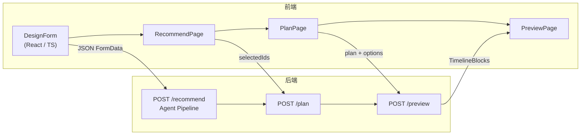

# Tripllery v3 —— AI Agent 旅行策划黑客松提交文档（中文版）

---

## 项目概述

Tripllery v3 是一套 **「AI Agent × 前后端全栈一体化」** 的智能旅行策划平台：

1. **表单收集 → AI Agent → 推荐 POI → 排期 → 四象限预览** 的端到端体验仅需 3 步：填写 -> 选择 -> 预览。
    
2. 全链路由 **LLM + 工具调用** 组成的 _Travel Agent_ 自动完成「关键词提取-> 查询生成-> POI 聚合-> 评论抓取-> 卡片融合-> 评分排序-> 行程优化」。
    
3. 前端通过 **Card-Selector / Timeline-Preview** 两大核心页，实时与后端 Agent 协同，完成「挑选-> 排期-> 预览」的闭环。
    

---

## AI Agent 目标 & 黑客松对接要点

|黑客松评审指标|Tripllery v3 满足方式|
|:--|:--|
|**工具使用**|Places API、Directions API、XHS 爬虫、LLM ChatCompletion 多轮调用|
|**自主决策链**|Chain：① 关键词抽取→② 多城市查询→③ POI 清洗→④ 评论高亮→⑤ 卡片融合→⑥ 评分→⑦ 旅行风格分类→⑧ 天数分配→⑨ 半天时间轴生成|
|**实时可交互**|前端对 Agent 结果做二次筛选与调整，Agent 可根据用户二次反馈重新学习 tag|
|**端到端 Demo**|提交 Form → Demo 返回完整出行预览（含地图 / 时间轴 / 日历）|

---

## 项目需求 & 功能文档 & UI/UX

- **需求**：让用户在 < 2 分钟内得到一份可落地、可视化的旅行时间表
    
- **核心功能**
    
    - 智能 POI 推荐（评分 / 亮点 tag / 开放二次筛选）
        
    - 一键生成行程（按天 -> 上午/下午 -> 精确时间块）
        
    - 四象限预览：地图-时间轴-日历-文字列表 100 % 同步高亮
        
- **UX**：移动优先卡片流 + PC 级时间表；极简三步流 (Design → Recommend → Preview)
    

---

## 第1章　系统总览（System Overview）



---

## 第2章　完整 API 层与交互规范（Full API Layer & Integration）

|HTTP|路由|入参 (核心字段)|出参 (核心字段)|前端调用位置|
|:--|:--|:--|:--|:--|
|**POST**|`/recommend`|`FormData`|`cards[]`, `all_pois[]`, `min_required`|`RecommendPage`|
|**GET**|`/recommend/more`|`start,size`|`cards[]`|“More Cards”|
|**POST**|`/plan`|`accepted_pois[]`, `all_pois[]`, _FormData_|`plan{ Day→POI[] }`, `options`|`PlanPage`|
|**POST**|`/preview`|`plan`, `options`|`full_schedule{ date→TimelineBlock[] }`|`PreviewPage`|

> **字段统一**：前后端全部复用 `@/types/FormData.ts`、`@/types/POI.ts`、`@/types/TimelineBlock.ts`。

---

## 第3章　原型界面与状态流转（Prototype UI & State Sync）

|页面|关键状态|触发动作|下一步|
|:--|:--|:--|:--|
|DesignPage|`FormData`|点击 **Start Recommendation**|navigate ➜ Recommend|
|RecommendPage|`selectedIds`, `cards[]`|点击 **I’m Done**|navigate ➜ Plan|
|PlanPage|`plan{}`|点击 **Preview**|navigate ➜ Preview|
|PreviewPage|`selectedDay`, `activeId`|Calendar / Hover / Click|四象限实时同步|

---

## 第4章　技术架构与环境配置（Tech Stack & Setup）

|层|技术栈|说明|
|:--|:--|:--|
|前端|React 18 + Vite + TypeScript + TailwindCSS|SPA；Vite CLI 一键启动|
|后端|Python 3.10 + Quart + Async OpenAI SDK|全程 async；uvicorn 本地启动|
|数据/外部|Google Places / Directions、.env|API Key 统一 .env|
|部署|Render / Vercel|CI：`pnpm build && quart run`|

---

## 第5章　核心模块与职责（Core Modules Overview）

|模块|主要职责|
|:--|:--|
|**agent.llm_intent**|解析 FormData → keywords|
|**maps.fetcher**|Google Places 拉取 POI|
|**crawler.xiaohongshu**|Mock 评论抓取|
|**agent.fusion**|组装卡片（描述 + tag）|
|**services/plan**|智能分天 / 半天 / 时间块|
|**preview.builder**|Directions 批量耗时 + 时间线拼装|
|**frontend/components**|Card / Timeline / Map / Axis / Calendar|
|**hooks/useTimelineSelection**|四象限共享高亮 ID|

---

## 第6章　数据格式与处理标准（Data Format & Transformation）

```ts
// POI
interface POI {
  id: string; name: string; lat: number; lng: number;
  rating?: number; image_url?: string;
  description: string; highlight_tags?: string[];
  source?: { google_maps_url?: string; review_links?: string[] }
}

// TimelineBlock
interface TimelineBlock {
  id?: string; day: string;
  start_time: string; end_time: string;
  activity: string; type: "Sightseeing" | "Meal" | "Transportation" | "Return" | "Flexible";
  lat?: number; lng?: number; polyline?: string;
}
```

> 所有接口直接返回以上结构，前端不再做二次 Map/Parse。

---

## 第7章　错误处理与体验优化（Error Handling & UX Recovery）

|场景|后端兜底|前端兜底|用户提示|
|:--|:--|:--|:--|
|Google API 失败|fallback 默认图 / 距离|Toast + 默认图片|“部分图片加载失败但不影响使用”|
|LLM 超时 / 返回格式错|fallback `simple_split_days`|Banner 重试按钮|“智能排期失败，已用默认均分”|
|Directions 失败|10/15 min 固定时长|黄色 Warning Tip|“路线估时基于默认值”|
|选 POI 不够|HTTP 400 + `min_required`|Submit 按钮 disabled|“至少选择 N 个景点才能生成行程”|

---

## 第8章　本地开发与快速启动指南（Local Dev & Quick Start）

```bash
# 1️⃣ 克隆
git clone https://github.com/XXX/tripllery-v3 && cd tripllery-v3

# 2️⃣ 安装依赖
pnpm i            # 前端
pip install -r backend/requirements.txt  # 后端

# 3️⃣ 配置环境
cp .env.example .env   # 置入 OpenAI / Google API Key

# 4️⃣ 一键启动
pnpm dev &  # Vite localhost:5173
python backend/app.py  # Quart localhost:5001
```

---

## 第9章　部署与发布指南（Build & Deployment）

|步骤|前端|后端|
|:--|:--|:--|
|**CI**|`pnpm build` → `dist/`|`python -m pip install -r requirements.txt`|
|**Docker**|`Dockerfile.frontend` (Nginx + dist)|`Dockerfile.backend` (uvicorn)|
|**云托管**|Vercel / Netlify|Render / Fly.io|
|**域名 & SSL**|Cloudflare 全局 CDN|同步|

---

## 未来计划（Roadmap）

1. **多模态**：接入图片理解，为用户相册生成行程。
    
2. **即时协同**：多人共享行程并实时编辑；LLM 负责冲突解决。
    
3. **增量学习**：根据用户历史喜欢 / 取消的 POI 做长期偏好建模。
    
4. **离线 PWA**：生成离线可用的旅行手册 / 导航地图。
    

